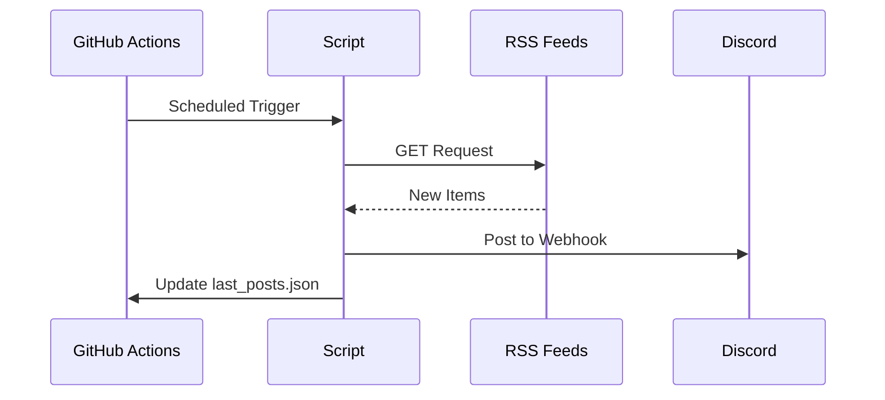

# RSS-Discord-Bridge

<p align="center">
  <a href="https://github.com/Gabryel666/RSS-Discord-Bridge/releases" target="_blank">
    
  </a>
  <a href="https://github.com/Gabryel666/RSS-Discord-Bridge/blob/main/LICENSE" target="_blank">
    
  </a>
  <a href="https://discord.gg/CrfgXxhu95" target="_blank">
    
  </a>
</p>

An automated script that monitors RSS feeds and pushes new articles to Discord channels with multi-channel support.

You can check the release notes by clicking on [Release notes](https://github.com/Gabryel666/RSS-Discord-Bridge/blob/main/release%20notes.md)

## 🚀 Installation & Configuration (The Easy Way)

This project comes with a **built-in configuration website** to help you manage your feeds without editing code.

### 1. Enable the Config Site

After forking this repository (making your own copy):

1.  Go to **Settings** > **Actions** > **General** and select **Allow all actions and reusable workflows**. Click **Save**.
2.  Go to **Settings** > **Pages**.
3.  Under "Build and deployment", set **Branch** to `main` and folder to `/docs`. Click **Save**.
4.  Wait 1-2 minutes. Your configuration site will appear at:
    `https://YOUR-USERNAME.github.io/RSS-Discord-Bridge/`

**👉 Use this website to follow the setup guide and manage your RSS feeds easily.**

---

## Key Features

- **Exhaustive History Retrieval**: Retrieves *all* missed articles between checks.
- **Smart Desync Protection**: Prevents spam if a feed changes significantly.
- **Multi-Channel Routing**: Send feeds to different Discord channels.
- **Multi-Feed Tracking**: Monitor unlimited RSS feeds.
- **Web Dashboard**: Manage feeds via a friendly UI (`/docs`).
- **Scheduled Updates**: Configurable check frequency via GitHub Actions.

## Manual Setup (Advanced)

If you prefer not to use the web interface, you can configure everything manually:

1.  **Clone the repository**:
    ```bash
    git clone https://github.com/Gabryel666/RSS-Discord-Bridge.git
    cd RSS-Discord-Bridge
    ```

2.  **Configure feeds**:
    Edit `feeds.json`:
    ```json
    {
      "Hugin & Munin": {
        "url": "https://example.com/feed.rss",
        "webhookKey": "news"
      }
    }
    ```

3.  **Set up Discord webhooks**:
    Add them to GitHub Secrets as `DISCORD_WEBHOOKS`:
    ```json
    {
      "news": "https://discord.com/api/webhooks/..."
    }
    ```

## Technical Overview



## 📄 License

MIT © [Gabryel666] - Free for use and modification
